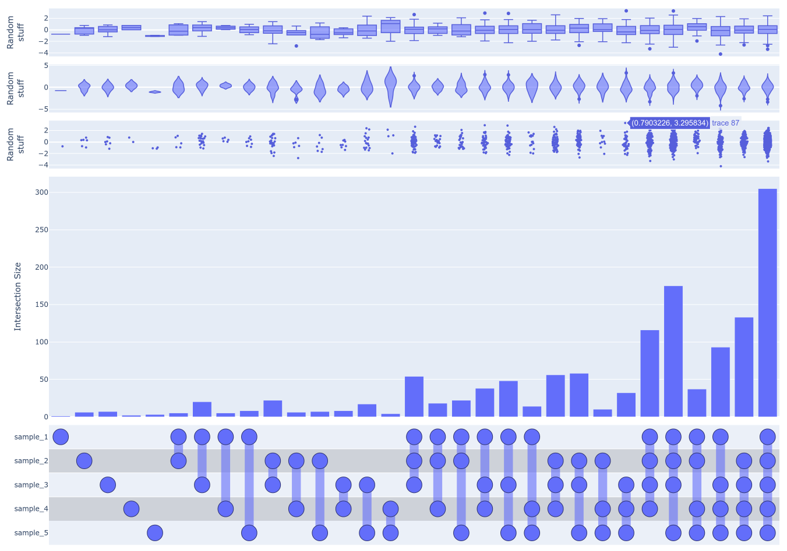
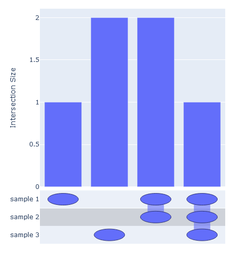
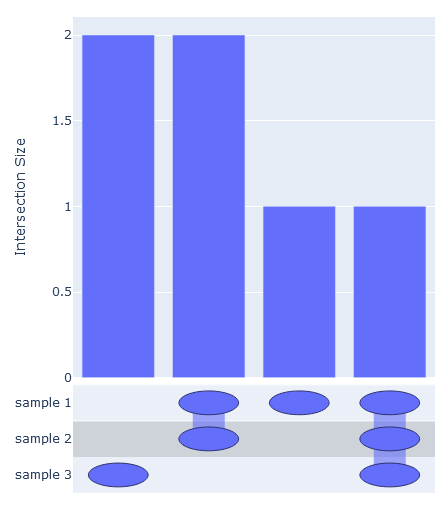
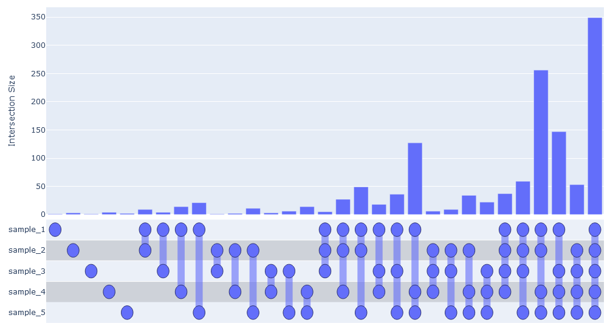
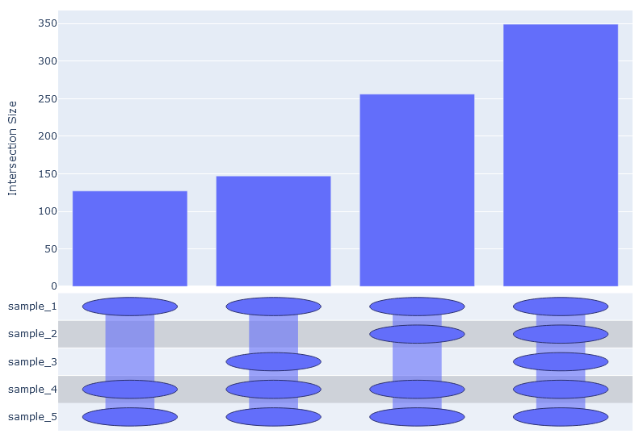
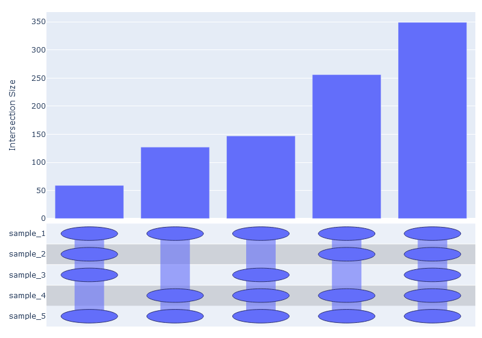
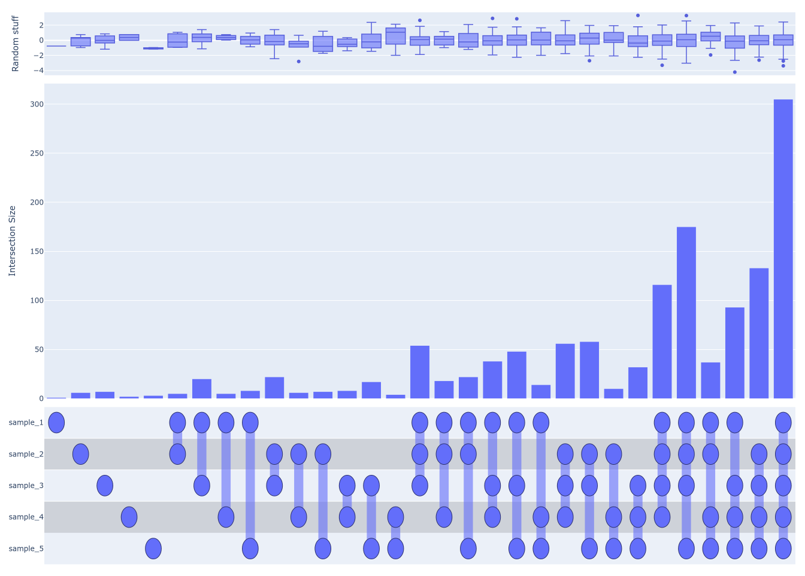
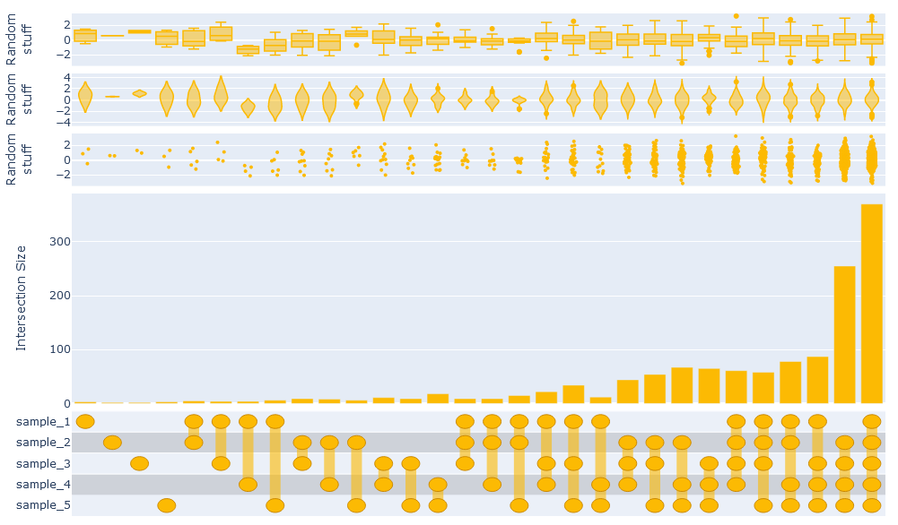
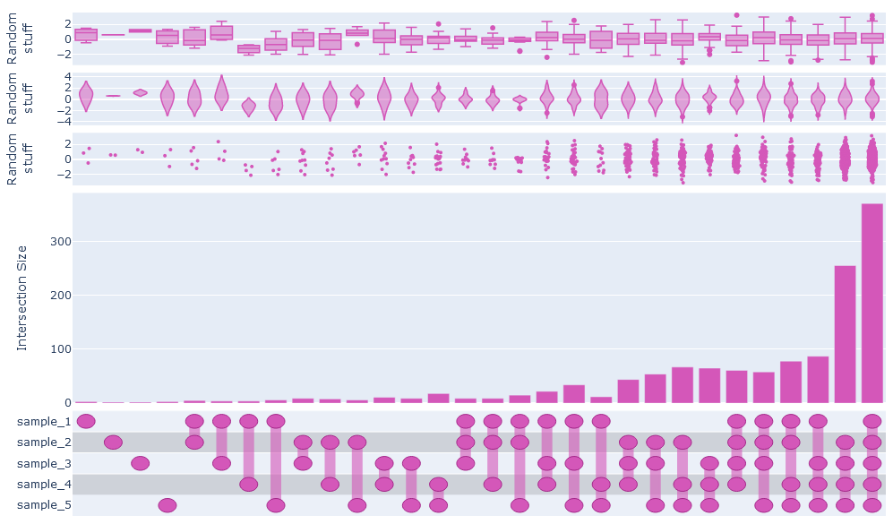

# UpSetPlotly

Generate UpSetPlot-style plots with Plotly.



## Contents

- [What is an UpSet plot?](#what-is)
- [Why another UpSet package for Python?](#why-another)
- [Usage](#usage)
- [How to cite](#how-to-cite)

<a id="what-is"></a>

## What is an upset plot?

An UpSet plot is a means of visualizing intersecting sets. For detailed information, 
[follow this link](https://jku-vds-lab.at/tools/upset/). The [original UpSet](https://www.ncbi.nlm.nih.gov/pmc/articles/PMC4720993/) 
plot is quite the tool, with an enormous amount of flexibility and the ability to visualize many, many aspects of 
a dataset. My particular needs are much more modest, and I am usually only interested in the core of the figure 
and possibly one or two secondary plots describing the intersections. There are tools that do this [in R](https://github.com/hms-dbmi/UpSetR)
and [in Python](https://github.com/jnothman/UpSetPlot). So why another one? That leads nicely into the next section...

<a id="why-another"></a>

## Why another UpSet package for Python?

[UpSetPlot](https://github.com/jnothman/UpSetPlot) is a fine package and is well maintained. I have used it before and 
haven't had any complaints. The reason I decided to make another package to generate 
UpSet plots is because another project I'm working on, [MhcVizPipe](https://github.com/CaronLab/MhcVizPipe), uses 
Plotly to generate plots as part of an HTML report. [UpSetPlot](https://github.com/jnothman/UpSetPlot) only uses 
matplotlib. I wanted to have an UpSet plot in the reports, but I wanted it to 
match the style and format of the other figures in the report. I also didn't want to have matplotlib as a requirement 
when it was only being used for one of the many plots.

<a id="usage"></a>

## Usage

```shell
$ pip install UpSetPlotly
```

```python
from upsetplotly import UpSetPlotly

samples = [[1, 2, 3, 4], [2, 3, 4], [2, 5, 6]]
names = ["sample 1", "sample 2", "sample 3"]

usp = UpSetPlotly(samples=samples, sample_names=names)
usp.plot()
```



The intersections can be ordered by passing `order_by={'increasing', 'decreasing'}`

```python
usp.plot(order_by='decreasing')
```


Larger sets are okay too.

```python
import random

names = [f'sample_{i}' for i in range(1, 6)]
samples = [[''.join(random.choices('abcdefghijk', k=3)) for x in range(random.randint(1000, 3000))] for i in range(5)]

usp = UpSetPlotly(samples, names)
usp.plot()
```



But there would soon be too many possible intersections to realistically visualize them all. 
We can pass `intersection_limit='by_total 0.05'` to filter out any intersections which are smaller
that 5% of the total number of unique elements. Any float between 0 and 1 is acceptable.

```python
usp.plot(order_by='increasing', intersection_limit='by_total 0.05')
```



Similarly, we can pass `intersection_limit='by_sample 0.05` to filter out any intersections which
do not comprise at least 5% of any sample.

```python
usp.plot(order_by='increasing', intersection_limit='by_sample 0.05')
```



Additional data describing the elements can be passed to generate secondary plots above the 
UpSet plot.

```python
all_elements = set()
all_elements.update(*[set(x) for x in samples])
additional_data = {element: random.normalvariate(0, 1) for element in all_elements}
usp.add_secondary_plot(data=additional_data, label='Random stuff', plot_type='box')
```



We can also do violin or swarm plots, or all three. Note that, annoyingly, we have to use html tags to create
line breaks in the labels. This will keep them from colliding in this case.

```python
usp = UpSetPlotly(samples, names)
usp.add_secondary_plot(data=additional_data, label='Random<br>stuff', plot_type='box')
usp.add_secondary_plot(data=additional_data, label='Random<br>stuff', plot_type='violin')
usp.add_secondary_plot(data=additional_data, label='Random<br>stuff', plot_type='swarm')
usp.plot()
```


Finally, you can change the color scheme (a bit). By passing the `color` argument to 
`UpSetPlotly.plot`, you set the base color for the image. Unfortunately you have to pass
in either HEX values or an RGB string (e.g. `'rgb(..., ..., ...)'`)

```python
usp.plot(color='#fcba03')
usp.plot(color='rgb(212, 87, 185)')
```




<a id="how-to-cite"></a>

## How to cite

If you find UpSetPlotly useful, please acknowledge our work and the work of others with the following citations:

- Kovalchik, K. A., Wessling, L., Saab, F., Ma, Q., Despault, J., Kubiniok, P., Hameline, D., Faridi, P., Li, C., Purcell, A., Tognetti, M., Reiter,
L., Bruderer, R., Lanoix, J., Bonneil, E., Courcelles, M., Thibault, P., Caron, E., Sirois, I. MhcVizPipe: A Quality Control Software for Ultra-
Rapid Assessment of Mass Spectrometry-based Immunopeptidomics Data. Molecular and Cellular Proteomics (in revision).
- Lex, A., Gehlenborg, N., Strobelt, H., Vuillemot, R., & Pfister, H. (2014). UpSet: Visualization of Intersecting 
Sets. IEEE transactions on visualization and computer graphics, 20(12), 1983–1992. https://doi.org/10.1109/TVCG.2014.2346248
